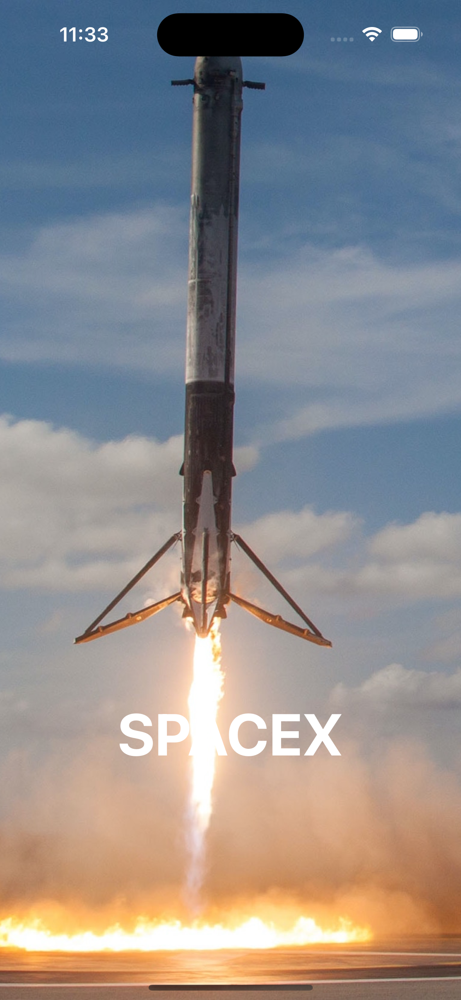
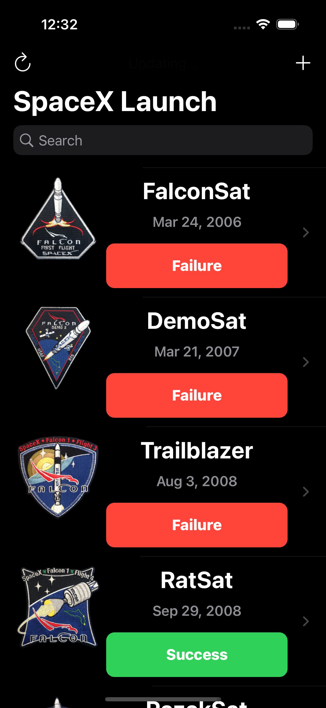
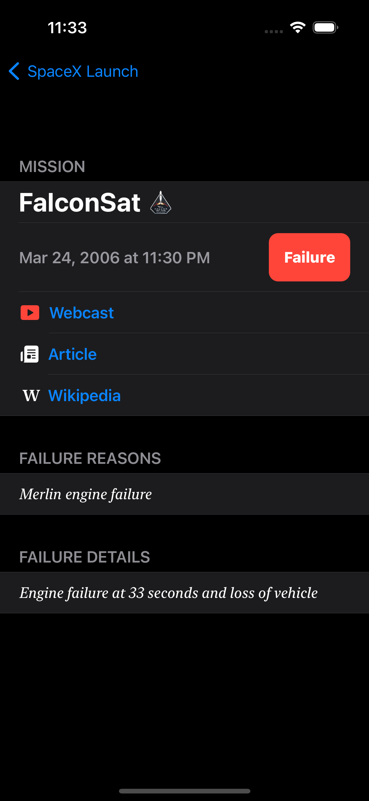

# Screenshots :camera:
| Start Screen | Launch Screen | Detail Screen |
| - | - | - |
|  |  |  |

# Description :page_with_curl:

## Launch screen (preview)
 
- Fetches JSON data from REST end-point.
- Show a preview of the launches.
- Refresh and renew data manually.
- Sort data by date and name.
- Search by name.
- User feedback regarding updating data.

## Details screen

- Name of mission.
- If mission succeeded.
- Launch date.
- Webcast link (youtube video).
- Article link.
- Wikipedia link.
- Failure reason (if mission failed).
- Failure details (if mission failed).
